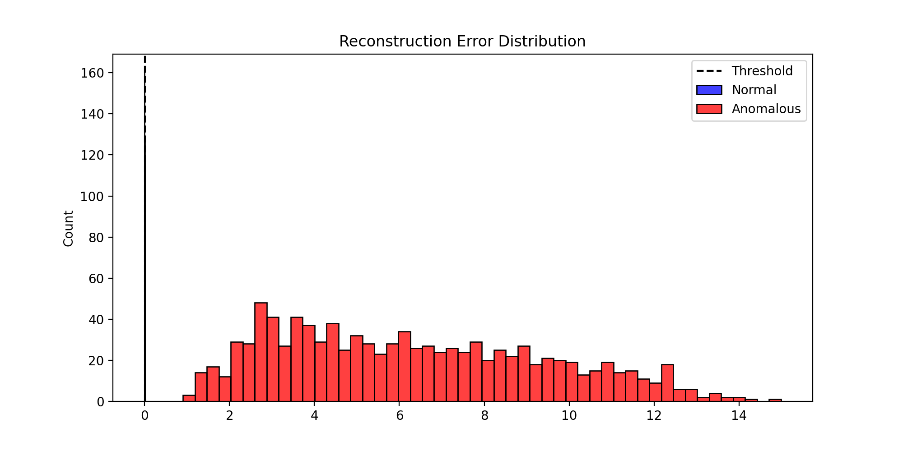
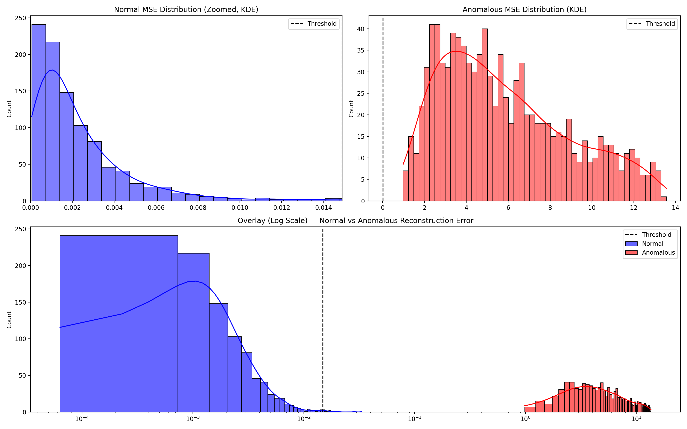

# deep-autoencoder-anomaly-detection
Deep Autoencoder that learns normal time-series patterns and detects unusual signals better than classical ML.

A compact implementation of a deep autoencoder for anomaly detection in time-series data. This project trains an autoencoder to learn "normal" patterns and flags deviations as anomalies. It's intended as a research / demo repository with a minimal runnable entrypoint (`main.py`) and simple result logging (`results/results.txt`).

**Key idea:** an autoencoder compresses and reconstructs inputs. Large reconstruction errors indicate inputs that differ from the learned normal behavior and can be treated as anomalies.

**Status:** Minimal demo — see `main.py` and `results/results.txt` for how experiments are run and results are recorded.

**Table of Contents**

- **Project**: Overview and goals
- **Requirements**: Python packages needed
- **Installation**: how to set up the environment
- **Quick Start**: run training and inference
- **Files**: important files in the repo
- **Configuration**: how to adapt dataset and hyperparameters
- **Results**: where outputs are written and how to interpret them
- **Contributing** and **License**

## Requirements

- Python 3.8+ recommended
- See `requirements.txt` for exact package versions

To install dependencies:

```zsh
python3 -m venv .venv
source .venv/bin/activate
pip install -r requirements.txt
```

If you use a GPU, ensure you have the appropriate CUDA/cuDNN and the matching `torch` wheel (if `torch` is a dependency).

## Quick Start

1. Install requirements (see above).
2. Prepare your dataset (see the Configuration section).
3. Run the main script:

```zsh
# Train model (default behavior depends on the implementation in main.py)
python main.py

# If your main.py supports flags, try:
# python main.py --train --data path/to/data.csv --out results/
```

After running, check `results/results.txt` for logged metrics and experiment notes.

## Files / Project structure

- `main.py` — project entrypoint. Trains / evaluates the autoencoder and writes results.
- `requirements.txt` — Python dependencies for reproducible environment.
- `results/` — output folder containing `results.txt` with run summaries.
- `README.md` — this file.

If you add datasets or checkpoints, place them in a separate `data/` or `checkpoints/` folder and update `main.py` accordingly.

## Configuration

This repository uses a minimal configuration. To adapt the project:

- Edit `main.py` to change model architecture, optimizer, or training loop.
- Add a command-line argument parser (e.g., `argparse`) if not present — sample flags: `--train`, `--eval`, `--data`, `--epochs`, `--batch-size`, `--lr`, `--seed`.
- Ensure data is scaled/normalized consistently (autoencoders are sensitive to input scale).

## Expected Input / Dataset

The project expects time-series data representing normal and (optionally) anomalous sequences. Typical preprocessing steps:

- Window the time-series into fixed-length sequences
- Normalize each feature (standardization or min-max)
- Provide training data containing mostly normal examples; use held-out data with anomalies for evaluation

If you don't yet have a dataset, synthesize simple signals (sinusoids + noise) and inject spikes or drifts as anomalies to test the pipeline.

## Results and Evaluation

- The repository writes summary information to `results/results.txt`.
- Typical metrics: reconstruction error distribution, precision/recall at chosen thresholds, AUC (ROC or PR) if labels are available.

How to interpret `results/results.txt`:

- Look for average reconstruction error on validation data (normal vs anomalous).
- Larger gaps between normal and anomalous error distributions generally indicate better separability.

## Visual Results

The `results/` folder contains visualizations created during experiments. Examples:

- **Reconstruction error distribution**: shows the distribution of reconstruction errors for normal vs anomalous samples.

	

- **Reconstruction error panels**: multi-panel view showing per-sequence errors or multiple experimental conditions.

	

## Reproducibility Tips

- Fix random seeds for NumPy, PyTorch/TensorFlow, and Python's `random` module.
- Record package versions (`pip freeze > requirements.txt`) and hardware used.
- Save model checkpoints so you can re-evaluate or inspect reconstructions.

## Contributing

Contributions are welcome. Suggested workflow:

1. Fork the repository.
2. Create a feature branch: `git checkout -b feature/your-feature`.
3. Add tests or runnable examples for large changes.
4. Open a pull request describing your changes.

Please keep changes focused and include small reproducible examples when possible.

## License & Contact

This repository does not include an explicit license file. If you want to make it public, add a `LICENSE` (e.g., MIT) to clarify reuse terms.

For questions or help, open an issue in the repository or contact the maintainer.
